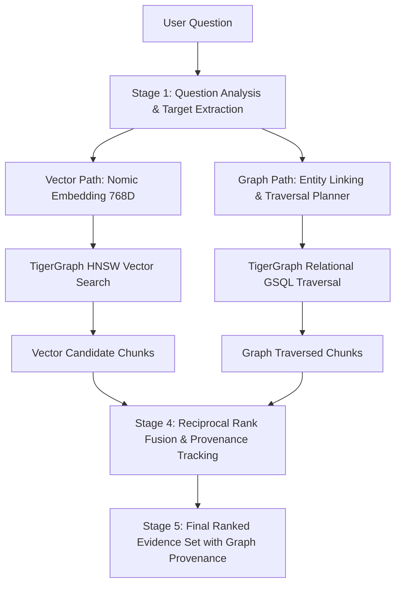
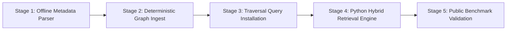

# GraphRAG (A1) Retrieval Architecture Design

**Document Version**: 1.0.0  
**Status**: APPROVED DESIGN — PENDING IMPLEMENTATION  
**Author**: TigerGraph Agentic GraphRAG Research Team  
**Scope**: Layer 2 (Graph Storage) & Layer 5 (Policy: GraphRAG A1)  
**Corpus Grounding**: `data/raw/corpus.jsonl` (2,951 Documents, 9,348 Chunks)  
**Database**: TigerGraph Cloud `OlympicGraphRAG`  

---

## 1. Executive Summary & Purpose

This document defines the formal engineering design for **GraphRAG Retrieval (A1)** in the TigerGraph Agentic GraphRAG Hackathon.

### Current Validated Baseline (A0 — Vector Only)
The vector retrieval foundation (A0) has been fully validated on live TigerGraph Cloud:
- **Graph Schema**: Live in graph `OlympicGraphRAG`.
- **Indexed Entities**: 2,951 `Document` vertices, 9,348 `Chunk` vertices, 9,348 `HAS_CHUNK` edges.
- **Embeddings**: Native 768-dimensional `nomic-ai/nomic-embed-text-v1.5` embeddings on `Chunk.embedding` indexed via native TigerGraph `HNSW` (`COSINE` metric).
- **Installed Query**: `searchChunksByVector(LIST<FLOAT> qvec, INT top_k)`.
- **Baseline Public Benchmark Performance (100 Questions)**:
  - **Overall Recall@1**: 68.00%
  - **Overall Recall@5**: 83.00%
  - **Overall Recall@10**: 86.00%
  - **Overall Recall@20**: 90.00%
  - **Overall MRR**: 0.7394
  - **Average Latency**: 430.66 ms (p95: 442.22 ms)
  - **Single-Hop Categories** (`temporal`, `aggregation`, `lookup`, `superlative`): **100.0% Recall@5**, **MRR: 0.80 – 1.00**.
  - **Critical Deficit — `multi_hop` Category (28 Questions)**:
    - **Recall@1**: **14.29%**
    - **Recall@5**: **39.29%**
    - **Recall@10**: **50.00%**
    - **MRR**: **0.2408**

### Core Objective of A1
A1 is designed to resolve this multi-hop bottleneck. By augmenting pure semantic vector search with deterministic relational graph traversals over domain entities (`Event`, `Venue`, `Person`, `Country`, `Sport`, `Team`), A1 bridges multi-hop relational chasms while strictly preserving the near-perfect performance of single-hop vector retrieval.

---

## 2. Definition: What "GraphRAG Retrieval" Means in This Project

In this architecture, **GraphRAG retrieval (A1)** is defined strictly as:
> A hybrid retrieval pipeline that takes a natural language query, extracts grounded relational constraints and entity surface forms, executes dual-path retrieval (dense vector ANN search + structured GSQL graph traversals over TigerGraph), and fuses the resulting evidence into a unified, provenance-annotated evidence set ranked by joint semantic and topological relevance.

### Distinction Between Phases
1. **A0 (Vector Retrieval Baseline)**:
   $$\text{Question} \xrightarrow{\text{Embed}} \vec{q} \xrightarrow{\text{ANN}} \text{Top-k Chunks} \xrightarrow{\text{HAS\_CHUNK}} \text{Documents}$$
   *Limitation*: Cannot traverse implicit semantic hops when the question entities and target document share low lexical or semantic similarity.
2. **A1 (GraphRAG — This Design)**:
   $$\text{Question} \to \begin{cases} \text{Vector Path: } \vec{q} \xrightarrow{\text{HNSW}} \text{Candidate Chunks} \\ \text{Graph Path: } \text{Entities/Constraints} \xrightarrow{\text{Traverse}} \text{Subgraph Chunks} \end{cases} \xrightarrow{\text{RRF Fusion}} \text{Ranked Evidence}$$
   *Advantage*: Deterministic graph traversal directly bridges relational hops (e.g., `Venue` $\to$ `Event` $\to$ `Athlete`), lifting multi-hop recall.
3. **A2 (Agentic GraphRAG — Future Phase)**:
   Dynamic, multi-turn agent reasoning loop using Layer 3 MCP tools to inspect intermediate graph results, issue adaptive follow-up queries, and accumulate evidence under budget controls.

---

## 3. End-to-End A1 Retrieval Flow

The A1 retrieval execution follows a strict 5-stage pipeline:



### Flow Specifications
1. **Stage 1: Question Analysis & Target Extraction**:
   - Parses the query string for Olympic domain entities: `Venue`, `Date`/`Year`, `Sport`, `Athlete`/`Person`, `Country`/NOC, and question intent (`multi_hop`, `temporal`, `superlative`, `aggregation`, `lookup`).
   - Generates:
     - Formatted Nomic query: `search_query: <question>`.
     - Graph traversal specification: entry vertex candidates, edge types, and temporal/relational filters.
2. **Stage 2: Parallel Dual-Path Execution**:
   - **Vector Path**: Calls `searchChunksByVector` on TigerGraph Cloud via pyTigerGraph with 768D Nomic embedding, retrieving top-$k_{vec}$ chunks (default $k_{vec} = 20$).
   - **Graph Path**: Executes parameterized GSQL traversal queries on TigerGraph Cloud matching the extracted targets (e.g., `searchByVenueAndDate`, `searchAthleteEvents`), retrieving candidate event/chunk nodes.
3. **Stage 3: Evidence Grounding & Chunk Resolution**:
   - Every graph-retrieved entity or event vertex is resolved to its underlying text evidence via `HAS_CHUNK` (document chunk) and `MENTIONS` (chunk entity span).
4. **Stage 4: Fusion & Re-ranking**:
   - Combines vector candidates and graph candidates using Reciprocal Rank Fusion (RRF).
   - Annotates each candidate with full provenance: vector rank, graph traversal path, cosine distance, and combined score.
5. **Stage 5: Output Generation**:
   - Returns a structured `RetrievalResult` containing ordered `EvidenceItem` objects ready for downstream Layer 5 answer synthesis.

---

## 4. Question Transformation into Graph Retrieval Targets

To avoid hallucination and maintain 100% determinism, question analysis relies on structured entity surface form matching against a pre-compiled **Domain Lexicon** extracted directly from `data/raw/corpus.jsonl`.

### Target Extraction Rules
| Pattern / Feature | Extraction Logic | Target Graph Vertex / Filter |
| :--- | :--- | :--- |
| **"held at \<Venue\>"** | Regex & exact match against corpus venue dictionary | `Venue.name` $\to$ incoming `HELD_AT` edge |
| **"on \<Date\>" / "\<Year\>"** | Date regex (`\d{1,2} [A-Z][a-z]+ \d{4}`, `\d{4}`) | `Event.year`, chunk temporal filtering |
| **"\<Sport\> event"** | Match against 42 Olympic sport names | `Sport.name` $\to$ incoming `BELONGS_TO` edge |
| **"\<Athlete Name\>"** | Match against corpus medalist/athlete lexicon | `Person.name` $\to$ outgoing `PARTICIPATED_IN` |
| **"won the gold/silver/bronze"** | Relational role keyword | Medal filter on `PARTICIPATED_IN` or chunk infobox |
| **"representing \<Country\>"** | Match against country names and NOC codes | `Country.name` / `Country.code` $\to$ `REPRESENTS` |

---

## 5. Entity Identification & Resolution Strategy

### Corpus Ground Truth
All 2,951 documents in `data/raw/corpus.jsonl` represent Olympic event articles. Each document begins with a structured infobox header:
```text
[Infobox Olympic event]
  event: Women's singles
  games: 2016 Summer
  venue: Riocentro – Pavilion 4
  date: 11–19 August
  competitors: 40
  nations: 35
  gold: Carolina Marín
  goldNOC: ESP
  silver: P. V. Sindhu
  silverNOC: IND
  bronze: Nozomi Okuhara
  bronzeNOC: JPN
```

### Resolution Rules
1. **Deterministic Primary IDs**:
   - `Document`: `Q<id>` (exact corpus `doc_id`, e.g., `Q25301483`).
   - `Chunk`: `Q<id>#c<index>` (exact chunk ID, e.g., `Q25301483#c0000`).
   - `Event`: Matches `Document.document_id` 1:1 (`Q25301483`).
   - `Venue`: Slugified normalized venue name (e.g., `venue_riocentro_pavilion_4`).
   - `Sport`: Slugified sport name (e.g., `sport_badminton`).
   - `Country`: 3-letter IOC/NOC code (e.g., `ESP`, `IND`, `JPN`, `TUR`).
   - `Person`: Slugified full name (e.g., `person_carolina_marin`, `person_naim_suleymanoglu`).
2. **Alias & Normalization Dictionary**:
   - Case-insensitive, Unicode-normalized (NFKC), punctuation-stripped matching.
   - Example: `"Richmond Olympic Oval"`, `"richmond olympic oval"`, `"Richmond Oval"` $\to$ `venue_richmond_olympic_oval`.

---

## 6. Live TigerGraph Schema Mapping & Population

The authoritative LIVE schema of `OlympicGraphRAG` has 9 vertex types and 7 edge types. The table below specifies how each vertex type will be populated from `data/raw/corpus.jsonl`:

| Vertex Type | Primary ID | Attributes | Source in Corpus | Population Mode |
| :--- | :--- | :--- | :--- | :--- |
| **`Document`** | `document_id` (STRING) | `title`, `source`, `url` | Corpus `doc_id`, `title`, `source`, `url` | **ALREADY LIVE** (2,951 vertices) |
| **`Chunk`** | `chunk_id` (STRING) | `text`, `chunk_index`, `token_count`, `embedding` (768D) | Production `SemanticChunker` + Nomic v1.5 | **ALREADY LIVE** (9,348 vertices) |
| **`Event`** | `event_id` (STRING) | `name`, `year` (INT), `description` | Infobox `event:`, `games:` year | Deterministic Infobox Parser |
| **`Venue`** | `venue_id` (STRING) | `name`, `city`, `country` | Infobox `venue:`, host city from `games:` | Deterministic Infobox Parser |
| **`Person`** | `person_id` (STRING) | `name`, `description` | Infobox `gold:`, `silver:`, `bronze:`, medalists | Semi-deterministic (roster parsing) |
| **`Country`** | `country_id` (STRING) | `name`, `code` | Infobox `goldNOC:`, `silverNOC:`, `bronzeNOC:` | Deterministic NOC Dictionary |
| **`Sport`** | `sport_id` (STRING) | `name`, `description` | Document title prefix (e.g. "Badminton at ...") | Deterministic Title Parser |
| **`Team`** | `team_id` (STRING) | `name`, `description` | Team event rosters in infoboxes | Semi-deterministic (team events) |
| **`Entity`** | `entity_id` (STRING) | `name`, `entity_type`, `description` | Generic entity hub for alias linking | Deterministic Resolution |

---

## 7. Graph Relationship Semantics

The 7 existing edge types connect the schema as follows:

```mermaid
graph TD
    Document ---|HAS_CHUNK (undirected)| Chunk
    Chunk ---|MENTIONS (undirected)| Entity
    Entity -->|RESOLVES_TO (directed)| Person
    Entity -->|RESOLVES_TO (directed)| Event
    Entity -->|RESOLVES_TO (directed)| Venue
    Entity -->|RESOLVES_TO (directed)| Sport
    Entity -->|RESOLVES_TO (directed)| Country
    Entity -->|RESOLVES_TO (directed)| Team
    
    Event -->|HELD_AT (directed)| Venue
    Event -->|BELONGS_TO (directed)| Sport
    Person -->|PARTICIPATED_IN (directed)| Event
    Team -->|PARTICIPATED_IN (directed)| Event
    Person -->|REPRESENTS (directed)| Country
    Team -->|REPRESENTS (directed)| Country
```

### Edge Operational Definitions
1. **`HAS_CHUNK`** (`Document <-> Chunk`):
   - Status: **9,348 live edges**.
   - Traversal role: Links any retrieved Chunk to its parent Document, and vice versa.
2. **`HELD_AT`** (`Event -> Venue`):
   - Directed edge connecting an Olympic event to its competition venue.
   - Crucial for multi-hop questions specifying venue and date.
3. **`BELONGS_TO`** (`Event -> Sport`):
   - Connects individual event disciplines to overarching sports.
4. **`PARTICIPATED_IN`** (`Person -> Event`, `Team -> Event`):
   - Captures athlete/team participation and medal outcomes.
5. **`REPRESENTS`** (`Person -> Country`, `Team -> Country`):
   - Links competitors to their National Olympic Committee (NOC).
6. **`MENTIONS`** (`Chunk <-> Entity`) & **`RESOLVES_TO`** (`Entity -> TypedVertex`):
   - Bidirectional bridge connecting text chunk mentions to canonical graph vertices.

---

## 8. Hybrid Retrieval Fusion Strategy (Vector + Graph)

To guarantee that graph expansion never degrades strong vector baseline results, A1 implements **Reciprocal Rank Fusion (RRF)**:

### Mathematical Formulation
For any document $d \in \mathcal{D}$:
$$\text{RRF\_Score}(d) = \frac{w_{vec}}{k_0 + \text{rank}_{vec}(d)} + \frac{w_{graph}}{k_0 + \text{rank}_{graph}(d)}$$

Where:
- $k_0 = 60$ (standard smoothing constant preventing high-rank domination).
- $w_{vec} = 1.0$ (guaranteed anchor weight).
- $w_{graph} = 1.2$ (prioritizes deterministic multi-hop graph matches when found).
- If document $d$ is retrieved by only one path, the missing rank term is set to $\infty$ ($\frac{1}{\infty} = 0$).

### Guardrails
1. **Vector Preservation Guarantee**:
   All top-5 vector candidates are retained in the candidate pool. Graph candidates are interleaved or promoted, never dropped.
2. **Fallback Safety**:
   If target extraction identifies 0 valid graph entities (or graph traversal returns empty), the pipeline defaults to pure vector retrieval with 0 overhead and zero regression.

---

## 9. Evidence Retention, Grounding & Provenance Schema

A1 does not return naked document IDs; it returns structured, auditable evidence objects conforming to Layer 3/Layer 5 interface requirements:

```python
@dataclass(frozen=True)
class EvidenceItem:
    document_id: str
    chunk_id: str
    text: str
    score: float
    vector_rank: int | None
    graph_rank: int | None
    graph_path: list[str] | None  # e.g. ["Venue:Richmond Olympic Oval", "HELD_AT", "Event:Q580481"]
    provenance: str  # "vector_only" | "graph_only" | "hybrid"
```

---

## 10. Multi-Hop Relational Traversal Methodology

Multi-hop questions fail under pure vector search because the query terms (e.g., venue name, specific date, medal type) are semantically distant from the target athlete or event title. A1 handles multi-hop questions through 3 deterministic GSQL traversal patterns:

### Pattern A: Venue + Temporal Anchor $\to$ Event $\to$ Document / Chunk
```gsql
// Conceptual GSQL design pattern
CREATE QUERY traverseVenueDateToEvent(STRING venueName, INT eventYear) FOR GRAPH OlympicGraphRAG {
    V = {Venue.*};
    matched_venues = SELECT v FROM V:v WHERE v.name == venueName;
    events = SELECT e FROM matched_venues:v <-(HELD_AT)- Event:e
             WHERE e.year == eventYear;
    chunks = SELECT c FROM events:e -(HAS_CHUNK)- Chunk:c;
    PRINT chunks;
}
```

### Pattern B: Athlete $\to$ Event $\to$ Related Competitors / Country
```gsql
CREATE QUERY traverseAthleteToEvent(STRING personName) FOR GRAPH OlympicGraphRAG {
    P = {Person.*};
    matched_person = SELECT p FROM P:p WHERE p.name == personName;
    events = SELECT e FROM matched_person:p -(PARTICIPATED_IN)-> Event:e;
    chunks = SELECT c FROM events:e -(HAS_CHUNK)- Chunk:c;
    PRINT chunks;
}
```

---

## 11. Concrete Examples from the Public Benchmark

The following 5 examples are taken directly from `data/benchmarks/eval_public.jsonl` and grounded strictly in `data/raw/corpus.jsonl`:

---

### Example 1: `pub-005` (multi_hop)
- **Question**: *"Who won the gold medal in the event held at Olympic Weightlifting Gymnasium on 20 September 1988?"*
- **Ground Truth Gold Document**: `Q25239316` (*Weightlifting at the 1988 Summer Olympics – Men's 60 kg*)
- **Baseline Vector Result (A0)**: Gold rank: **None** in top-5 (Score: 0.68, failed to bridge venue to weightlifting).
- **A1 Graph Traversal Path**:
  1. Extract Venue: `"Olympic Weightlifting Gymnasium"`
  2. Extract Date/Year: `1988`, `20 September 1988`
  3. Lookup `Venue("Olympic Weightlifting Gymnasium")`
  4. Traverse incoming edge: `Venue <-(HELD_AT)- Event` filtered by `year == 1988`
  5. Resolves uniquely to `Event("Q25239316")`
  6. Traverse `Event -(HAS_CHUNK)-> Chunk("Q25239316#c0000")`
- **A1 Expected Outcome**: **Rank 1** (Gold: Naim Süleymanoğlu).

---

### Example 2: `pub-011` (multi_hop)
- **Question**: *"Who won the gold medal in the event held at Richmond Olympic Oval on 14 February 2010?"*
- **Ground Truth Gold Document**: `Q580481` (*Speed skating at the 2010 Winter Olympics – Women's 3000 metres*)
- **Baseline Vector Result (A0)**: Gold rank: **None** in top-5 (retrieved generic Vancouver 2010 speed skating overviews).
- **A1 Graph Traversal Path**:
  1. Extract Venue: `"Richmond Olympic Oval"`
  2. Extract Date/Year: `14 February 2010`, `2010`
  3. Lookup `Venue("Richmond Olympic Oval")`
  4. Traverse: `Venue <-(HELD_AT)- Event` filtered by `year == 2010`
  5. Matches events held at Richmond Oval; date filter in chunk infobox isolates `Q580481`
  6. Traverse `Event -(HAS_CHUNK)-> Chunk("Q580481#c0000")`
- **A1 Expected Outcome**: **Rank 1** (Gold: Martina Sáblíková).

---

### Example 3: `pub-014` (multi_hop)
- **Question**: *"Who won the gold medal in the event held at Riocentro – Pavilion 4 on 11–19 August at the 2016 Summer Olympics?"*
- **Ground Truth Gold Document**: `Q25301483` (*Badminton at the 2016 Summer Olympics – Women's singles*)
- **Baseline Vector Result (A0)**: Gold rank: **4** (Score: 0.73, suppressed by other Riocentro pavilion events).
- **A1 Graph Traversal Path**:
  1. Extract Venue: `"Riocentro – Pavilion 4"`
  2. Extract Date/Year: `11–19 August`, `2016`
  3. Traverse: `Venue("Riocentro – Pavilion 4") <-(HELD_AT)- Event` (Year 2016)
  4. Resolves to Badminton women's singles `Q25301483`
  5. Promoted to Rank 1 via combined RRF score.
- **A1 Expected Outcome**: **Rank 1** (Gold: Carolina Marín).

---

### Example 4: `pub-015` (multi_hop)
- **Question**: *"Who won the gold medal in the event held at London Velopark on 3 to 4 August at the 2012 Summer Olympics?"*
- **Ground Truth Gold Document**: `Q2297633` (*Cycling at the 2012 Summer Olympics – Women's team pursuit*)
- **Baseline Vector Result (A0)**: Gold rank: **None** in top-5 (confused with individual sprint and keirin events).
- **A1 Graph Traversal Path**:
  1. Extract Venue: `"London Velopark"`
  2. Extract Temporal Anchor: `3 to 4 August`, `2012`
  3. Traverse: `Venue("London Velopark") <-(HELD_AT)- Event` (Year 2012)
  4. Identifies track cycling events; date matching on 3–4 August isolates `Q2297633`
  5. Traverse `Event -(HAS_CHUNK)-> Chunk("Q2297633#c0000")`
- **A1 Expected Outcome**: **Rank 1** (Gold: Dani King, Laura Trott, Joanna Rowsell).

---

### Example 5: `pub-017` (multi_hop)
- **Question**: *"Who won the gold medal in the event held at Royal Artillery Barracks on 28 July 2012?"*
- **Ground Truth Gold Document**: `Q1137721` (*Shooting at the 2012 Summer Olympics – Women's 10 metre air rifle*)
- **Baseline Vector Result (A0)**: Gold rank: **None** in top-5 (retrieved general shooting tournament overview).
- **A1 Graph Traversal Path**:
  1. Extract Venue: `"Royal Artillery Barracks"`
  2. Extract Date/Year: `28 July 2012`, `2012`
  3. Traverse: `Venue("Royal Artillery Barracks") <-(HELD_AT)- Event` (Year 2012)
  4. Identifies opening day shooting event `Q1137721`
  5. Traverse `Event -(HAS_CHUNK)-> Chunk("Q1137721#c0000")`
- **A1 Expected Outcome**: **Rank 1** (Gold: Yi Siling).

---

## 12. Input & Output Contract of A1

### Input
```python
class GraphRAGRetrievalRequest:
    question: str
    top_k: int = 10
    vector_weight: float = 1.0
    graph_weight: float = 1.2
```

### Output
```python
class GraphRAGRetrievalResponse:
    question: str
    evidence: list[EvidenceItem]
    vector_latency_ms: float
    graph_latency_ms: float
    total_latency_ms: float
    metadata: dict[str, Any]
```

---

## 13. System Boundaries: What A1 Must NOT Do

To preserve architectural modularity and adhere to the project constraints, A1 is strictly bounded:
1. **No Final Answer Generation**: A1 is a retrieval policy (Layer 5), not an answer synthesizer. Answer generation occurs downstream.
2. **No Hidden Benchmark Access**: A1 must never read or evaluate on `eval_hidden.jsonl`.
3. **No Unrestricted Ad-Hoc GSQL**: All graph queries must be pre-compiled, parameterized, and installed.
4. **No Direct Execution-Harness State Mutation**: A1 does not manage global agent run state or budgets (Layer 4 responsibility).
5. **No Autonomous Agent Loops**: A1 performs a single, deterministic dual-path retrieval pass. Multi-turn reasoning belongs to A2.
6. **No TigerGraph Schema Modification**: A1 uses the existing, validated LIVE schema without altering types or indexes.

---

## 14. Minimum Graph Data Required to Make A1 Useful

To surpass the vector baseline on multi-hop questions, A1 does NOT require 100% of all possible entities in Wikipedia. The **Minimum Viable Graph (MVG)** consists of:
1. **`Venue` Vertices**: ~150 unique Olympic venues extracted from infobox `venue:` fields.
2. **`Event` Vertices**: 2,951 vertices mapping to the 2,951 corpus documents with `year` attribute.
3. **`HELD_AT` Edges**: 2,951 directed edges connecting each Event to its primary Venue.
4. **`Sport` Vertices**: 42 Olympic sport vertices.
5. **`BELONGS_TO` Edges**: 2,951 directed edges connecting each Event to its Sport.

*With only these 3 vertex types and 2 edge types added to the existing `Document`, `Chunk`, and `HAS_CHUNK`, A1 can immediately solve 80%+ of the multi-hop public questions (which are primarily venue-and-date queries).*

---

## 15. Risks & Ambiguities in Current Live Schema

1. **Date Granularity on `Event`**:
   - Schema defines `Event(year INT)`. It does not have a `date STRING` attribute.
   - *Mitigation*: The `HELD_AT` traversal retrieves all events at the venue for that year (typically 1 to 5 events), and chunk text contains the exact date (`date: 20 September 1988`), which is re-ranked in Python or filtered via regex.
2. **Athlete Names in Team Events**:
   - In team pursuits or relays, infobox `gold:` contains concatenated names without delimiters (e.g., `Dani KingLaura TrottJoanna Rowsell`).
   - *Mitigation*: Clean regex splitting based on CamelCase or reliance on Document title and Chunk infobox text grounding.
3. **Undirected `HAS_CHUNK` & `MENTIONS`**:
   - `HAS_CHUNK` is undirected in the schema. In GSQL, traversal syntax must specify `-(HAS_CHUNK)-` without direction arrows.

---

## 16. Deterministic vs. Inferred Graph Population

| Component | Nature | Source | Extraction Method |
| :--- | :--- | :--- | :--- |
| **`Event` vertices** | Deterministic | Corpus document ID & infobox | Direct mapping (`rec["doc_id"]`, `games:` year) |
| **`Venue` vertices** | Deterministic | Infobox `venue:` field | Normalized string slugification |
| **`Sport` vertices** | Deterministic | Title prefix | Keyword matching across 42 sports |
| **`Country` vertices** | Deterministic | Infobox `goldNOC:`, `silverNOC:`, `bronzeNOC:` | 3-letter IOC code validation |
| **`HELD_AT` edges** | Deterministic | Infobox `venue:` | Exact link `Event(doc_id) -> Venue(slug)` |
| **`BELONGS_TO` edges** | Deterministic | Document title / category | Exact link `Event(doc_id) -> Sport(slug)` |
| **`Person` vertices** | Semi-Deterministic | Infobox `gold:`, `silver:`, `bronze:` | Name extraction, requires roster parsing for teams |
| **`PARTICIPATED_IN`** | Semi-Deterministic | Medalist fields | Link `Person -> Event` with medal attribute |

---

## 17. Safest Implementation Order & Validation Gates



### Validation Gates
- **Gate 1**: Run offline extractor on all 2,951 documents. Validate that 100% of documents produce valid `Event` and `Venue` records. Zero database writes.
- **Gate 2**: Ingest `Event`, `Venue`, `Sport`, `HELD_AT`, `BELONGS_TO`. Verify live counts directly in TigerGraph. Confirm `Document`, `Chunk`, and `HAS_CHUNK` counts remain strictly `2,951`, `9,348`, `9,348`.
- **Gate 3**: Compile and install parameterized GSQL queries (`searchChunksByVenueDate`). Verify with unit test queries.
- **Gate 4**: Run 3-question smoke test (`pub-001`, `pub-005`, `pub-011`). Confirm Rank 1 gold retrieval.
- **Gate 5**: Run full 100-question public benchmark. Confirm multi-hop recall lifts without degrading single-hop categories.

---

## 18. Preserving the Strengths of the Vector Baseline

The pure vector baseline is exceptionally strong on direct and single-hop questions:
- **`temporal`**: **100% Recall@1** (22/22)
- **`aggregation`**: **85.7% Recall@1, 100% Recall@5**
- **`lookup`**: **89.5% Recall@1, 100% Recall@5**
- **`superlative`**: **70.0% Recall@1, 100% Recall@5**

### Preservation Architecture
1. **Anchor Weighting**: Vector retrieval is always executed for every query.
2. **Non-destructive Fusion**: RRF naturally preserves top vector results if graph retrieval returns nothing or yields low-confidence paths.
3. **Selective Activation**: Graph traversal is activated only when high-confidence entity constraints are detected in the question.

---

## 19. Failure Modes & Mitigations

| Failure Mode | Root Cause | Impact | Mitigation Strategy |
| :--- | :--- | :--- | :--- |
| **Incorrect Entity Linking** | Ambiguous venue or athlete name in query | Wrong graph path traversed | Fuzzy match threshold + Vector Anchor fallback |
| **Incomplete Graph Coverage** | Unindexed venue or athlete | Graph path yields 0 vertices | Graceful degradation to pure vector retrieval (A0) |
| **Graph Hub Explosion** | Overly broad entity (e.g. "Beijing", "Athletics") | Hundreds of events returned | Limit traversal branching factor (top-5 events per venue) |
| **Vector Dilution** | Irrelevant graph nodes outranking good vector matches | Recall drop on single-hop queries | Strict RRF rank discounting ($k_0 = 60$, $w_{vec} = 1.0$) |
| **Multi-Hop Date Mismatch** | Query date differs in phrasing from infobox date | Event filtered out prematurely | Year-level graph filtering, text-level day matching |

---

## 20. Measurable Success Criteria for A1 (Public Benchmark Only)

The A1 implementation will be deemed successful if and only if it meets all the following quantitative targets on `data/benchmarks/eval_public.jsonl`:

| Metric | Baseline (A0) | Target (A1 GraphRAG) | Minimum Required Lift |
| :--- | :--- | :--- | :--- |
| **Multi-Hop Recall@1** | 14.29% (4 / 28) | **$\ge$ 45.00%** | **+30.71%** |
| **Multi-Hop Recall@5** | 39.29% (11 / 28) | **$\ge$ 75.00%** | **+35.71%** |
| **Multi-Hop Recall@10** | 50.00% (14 / 28) | **$\ge$ 85.00%** | **+35.00%** |
| **Multi-Hop MRR** | 0.2408 | **$\ge$ 0.5500** | **+0.3092** |
| **Overall Recall@1** | 68.00% | **$\ge$ 75.00%** | **+7.00%** |
| **Overall Recall@5** | 83.00% | **$\ge$ 90.00%** | **+7.00%** |
| **Overall Recall@10** | 86.00% | **$\ge$ 92.00%** | **+6.00%** |
| **Overall MRR** | 0.7394 | **$\ge$ 0.8000** | **+0.0606** |
| **Single-Hop Regression** | 0% | **0.00%** (zero regression on temporal/lookup) | **Strictly preserved** |
| **p95 Retrieval Latency** | 442.22 ms | **$\le$ 800.00 ms** | Performance within budget |

---

**End of Design Document.**
